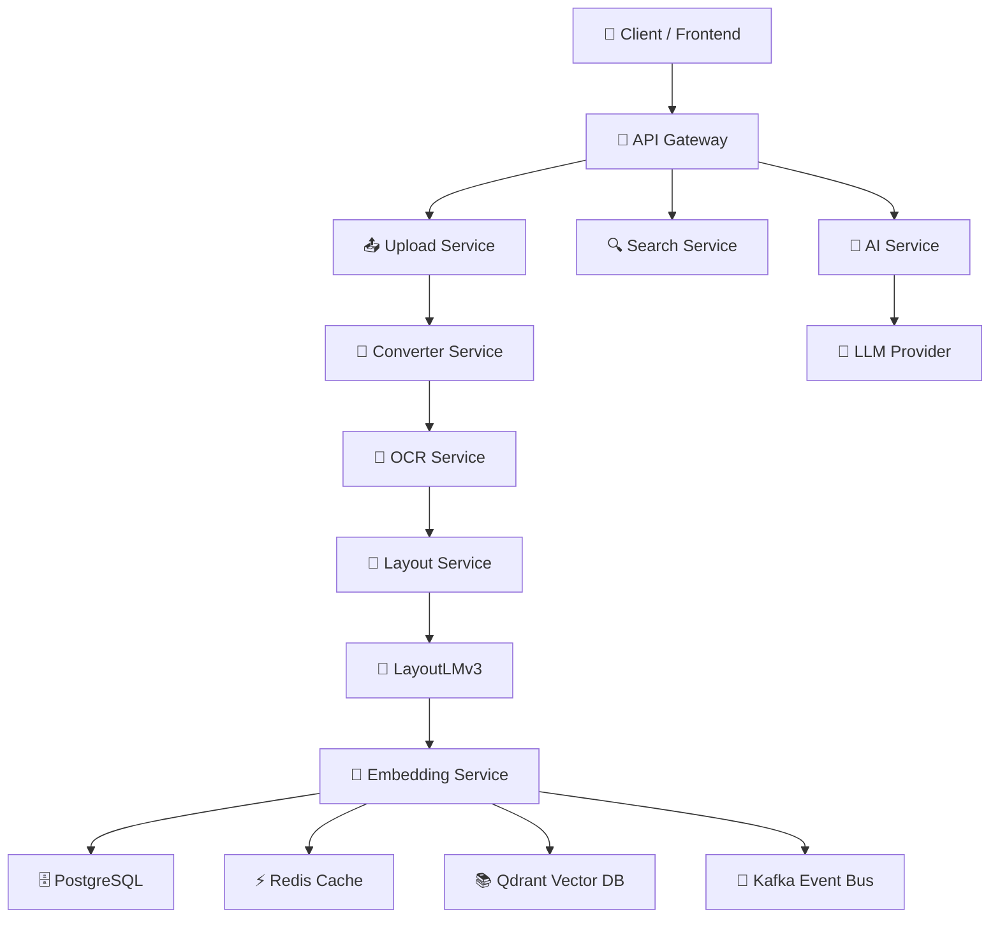
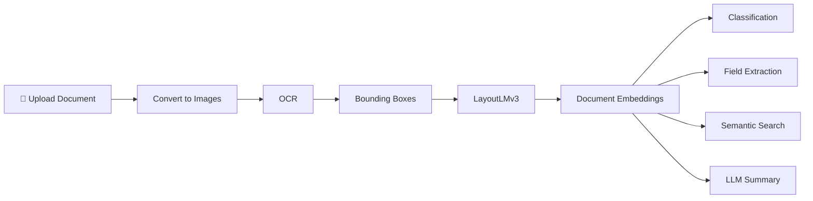
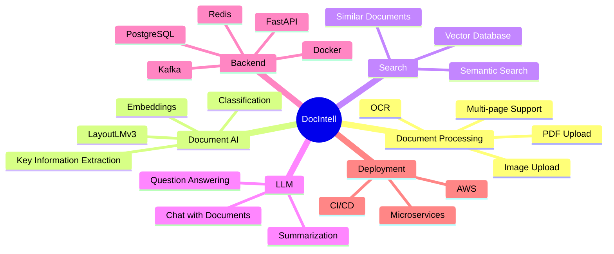

<h1 align="left">
DocIntell
</h1>

<h3 align="left">
Intelligent Document Processing Platform
</h3>

OCR • Document AI • Layout Understanding • LLM Integration • Distributed Systems

---

# Overview

DocIntell is a production-oriented Document Intelligence platform capable of understanding, processing and analyzing structured as well as unstructured documents.

Instead of treating documents as plain text, DocIntell combines OCR, layout-aware transformers, semantic embeddings and Large Language Models to extract meaningful information and enable intelligent document interactions.

The project is designed around scalable backend architecture and distributed processing, making it suitable for high-volume enterprise document workflows.

---

# Features

### Document Processing

- PDF/Image Upload
- Automatic File Conversion
- OCR Pipeline
- Layout-aware Document Understanding
- Multi-page Document Support

### AI Features

- Document Classification
- Key Information Extraction
- Layout-aware Embeddings
- Semantic Search
- Document Similarity Search
- LLM-powered Summarization
- Chat with Documents
- Metadata Extraction

### Backend Features

- REST API
- Asynchronous Processing
- Event-driven Architecture
- Microservice Ready
- Dockerized Deployment

---

---

# Technology Stack

## Backend

- Python
- FastAPI
- Uvicorn

## AI / Machine Learning

- EasyOCR
- LayoutLMv3
- HuggingFace Transformers
- PyTorch

## Data

- PostgreSQL
- Redis
- Qdrant Vector Database

## Distributed Systems

- Apache Kafka
- Docker
- Docker Compose

---

# Future Roadmap

- OCR Pipeline Optimization
- Document Versioning
- Distributed Worker Services
- Kafka Event Streaming
- Vector Search
- Multi-document Chat
- Knowledge Graph Generation
- Role Based Authentication
- Real-time Processing Dashboard
- Kubernetes Deployment
- CI/CD Pipeline
- ML Model Registry

---
