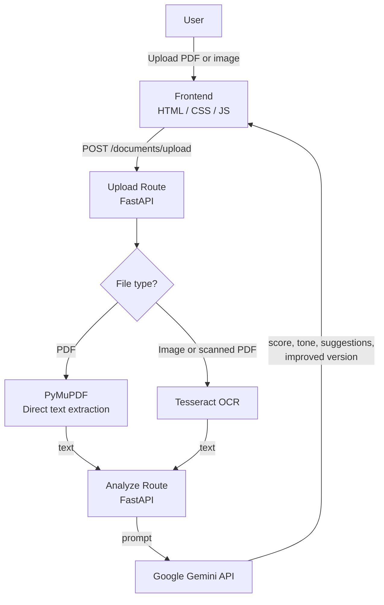

# Social Media Content Analyzer

Upload a PDF or image of a social media post and get AI-powered engagement analysis and improvement suggestions.

**Live demo:** https://socialmediadocparser-production-50f0.up.railway.app


---

## Features

- PDF upload with direct text extraction (PyMuPDF)
- Image upload (JPG, PNG, WEBP) with OCR fallback (Tesseract)
- AI engagement scoring out of 10
- Tone analysis
- Actionable improvement suggestions
- AI-rewritten version of the post
- Drag-and-drop interface with loading states and error handling

---

## Architecture



---

## Tech stack

| Layer | Technology |
|---|---|
| Backend | Python, FastAPI, Uvicorn |
| PDF parsing | PyMuPDF |
| OCR | Tesseract |
| AI analysis | Google Gemini (`google-genai`) |
| Frontend | HTML, CSS, JavaScript |
| Hosting | Railway |

---

## Setup

1. Clone the repo
```bash
   git clone https://github.com/singhshashwat2108/DocIntell_Application.git
   cd DocIntell_Application
```

2. Install Python dependencies
```bash
   pip install -r requirements.txt
```

3. Install Tesseract (Windows)
   Download from https://github.com/UB-Mannheim/tesseract/wiki and add it to your PATH

4. Set up environment variables
```bash
   cp .env.example .env
```
   Then open `.env` and add your Gemini API key

5. Run the app
```bash
   uvicorn backend.app:app --reload
```

6. Open http://localhost:8000

---

## Environment variables

| Variable | Description |
|---|---|
| `GEMINI_API_KEY` | API key for Google Gemini — used to generate engagement analysis |

Get a free key at https://aistudio.google.com

---

## Notes

- PDF text extraction uses PyMuPDF first (fast, no OCR needed for text-based PDFs). Tesseract OCR is only used when direct extraction returns no text (scanned documents, images).
- Processing is capped at 5 pages per document with a 45-second timeout.
- First OCR request after a cold start may be slow as Tesseract initialises.